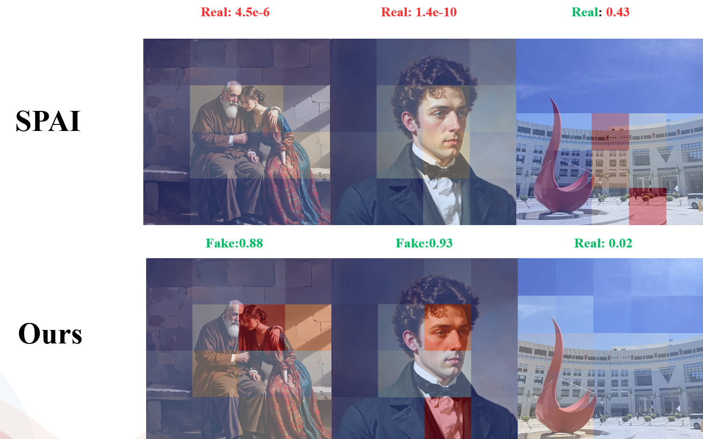

# SPAI + SVD Fine-tuning

This project is based on SPAI (CVPR 2025), a model that detects AIGI using frequency-domain reconstruction. This repo implements efficient fine-tuning for images generated by specific models using the SVD method.

## Architecture

### Core Ideas

1. **SPAI Frequency-Domain Detection Framework**: Detects AIGI by performing frequency decomposition (into high and low frequency) and evaluating reconstruction similarity in the frequency domain.
2. **SVD Method**: Applies SVD decomposition to the self-attention Linear layers of the CLIP backbone:
   - The top r singular values are retained as the **fixed main weights** (not trainable)
   - The remaining part forms the **trainable residual** (significantly reduces the number of trainable parameters)

### Model Structure

```
Input Image
    ↓
Frequency Decomposition (FFT + Mask) → [Original, Low-frequency, High-frequency]
    ↓
CLIP Backbone (with SVD) → [Original Feature, Low-frequency Feature, High-frequency Feature]
    ↓
FrequencyRestorationEstimator → Computes cosine similarity statistics
    ↓
ClassificationHead → AIGI Probability
```

### SVD Decomposition Details

SVD decomposition is performed on the Linear layers of the self-attention modules in CLIP:

```python
# Original weight W
U, S, Vh = torch.linalg.svd(W)

# Main weight (fixed, not trainable)
W_main = U[:, :r] @ diag(S[:r]) @ Vh[:r, :]

# Residual weight (trainable)
W_residual = U[:, r:] @ diag(S[r:]) @ Vh[r:, :]

# Total weight
W_total = W_main + W_residual
```

## Usage

### 1. Prepare Pretrained Weights

Make sure you have the following pretrained weights:

- **SPAI Weights**:
  - Place the SPAI pretrained weights at the following path: `./weights/spai.pth`
  - It is recommended to directly use the pretrained weights provided by the SPAI library, as they were trained on large-scale data and serve as a general detection model. You can download them here: [spai.pth](https://drive.google.com/file/d/1vvXmZqs6TVJdj8iF1oJ4L_fcgdQrp_YI/view?usp=sharing)


### 2. Prepare Data

Data format: CSV file with the following columns:
- `image`: Image path (relative or absolute)
- `split`: Data split (train/val/test)
- `class`: Class label (0=real, 1=AIGI)

Example:
```csv
image,split,class
path/to/image1.jpg,train,0
path/to/image2.jpg,train,1
```

To generate the CSV file, run `create_true_fake_csv.py` and provide the folder paths for real and fake images as input arguments. The script will automatically select an equal number of real images to match the quantity of fake images for training. The resulting CSV can be used for both training and testing.

### 3. Train

```bash
python train.py
```

### 4. Test

```bash
python test.py
```

### 5. Example





